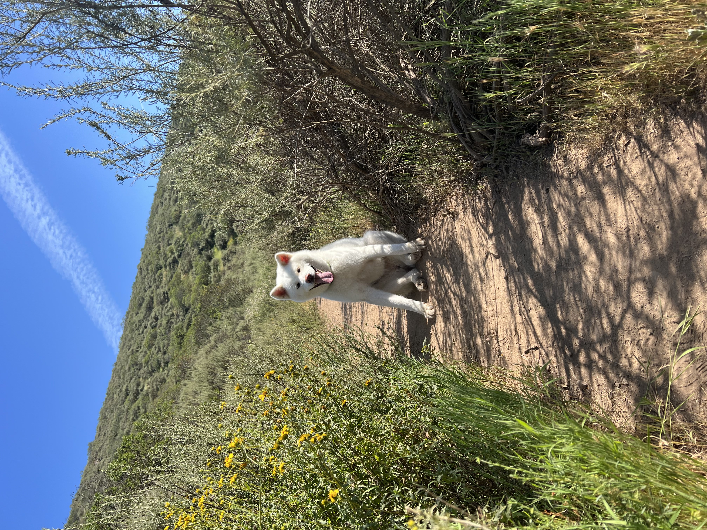

### Who I Am
Welcome to my user page! My name is Diana and I am a second year computer science major at UCSD. I enjoy hiking with my dog (seen below), playing video games, and reading books. 

First, I'd like to introduce one of my **favorite** quotes, which is a title of a book by Charles Swindoll:
> Life Is 10% What Happens to You and 90% How You React

## Fun Facts
My favorite line of code is:
```cpp
//TODO: fix this
```

## Links
[GitHub](https://github.com/muhshroom)

## Technical Skills
1. Languages: C, Python, Java
2. Tools: Git, conda, Docker

## My To-do List
- [ ] get a job

## Table of Contents
[Who I am](#who-i-am)  
[Fun Facts](#fun-facts)  
[Links](#links)  
[Technical Skills](#technical-skills)  
[My To-do list](#my-to-do-list)  

## Relative Links
[A link that links back to this page, wow!](index.md)